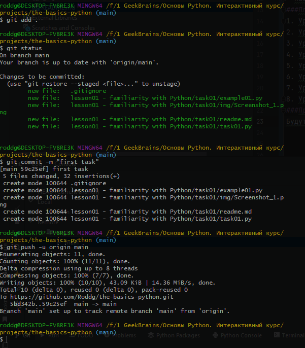
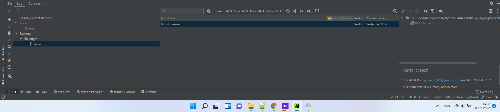

# Основы Python
### Структура материалов курса
- Курс состоит из 8 уроков по 2 часа.
- Практические задания.
- Видеозапись.
- Методичка, презентация и исходные коды.
- Примеры выполнения каждого задания.
### Цели курса
- Изучить основы Python.
- Проникнуться философией Python.
- Научиться писать правильный Python-код.
- Набить руку на задачах различной сложности.
### План курса
1. Урок Знакомство с Python
2. Урок Встроенные типы и операции с ними
3. Урок Функции
4. Урок Импорт, модули и полезные возможности языка 
5. Урок Работа с файлами
6. Урок ООП. Введение
7. Урок ООП. Продвинутый уровень
8. Урок ООП. Полезные дополнения
### Практические задания

Будут загружены на ***Githab*** через ***Git Bash***

Историю коммитов также отслеживаю через ***Pycharm***

