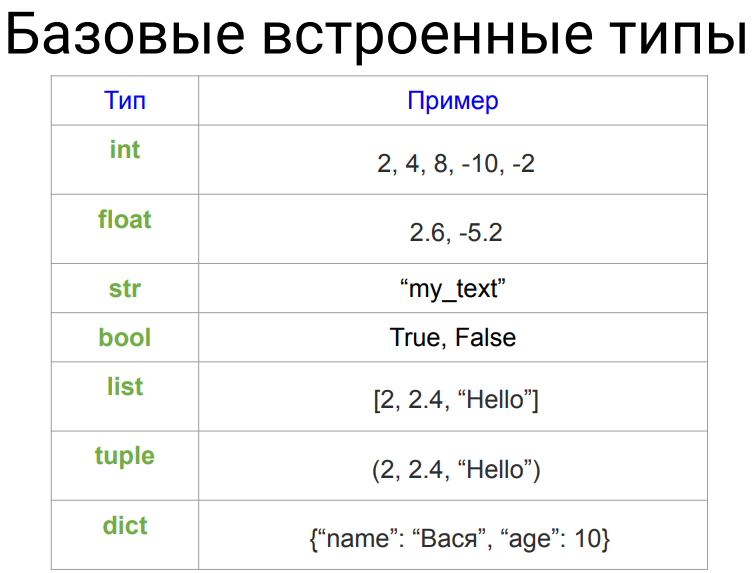

# Условие задачи

Поработайте с переменными, создайте несколько, выведите на экран, запросите у пользователя несколько чисел и строк и
сохраните в переменные, выведите на экран.\

### Базовые встроенные типы

| Тип   | Описание                                                                                        |           Пример            |
|-------|-------------------------------------------------------------------------------------------------|:---------------------------:|
| int   | Это функция, возвращающая целое число в десятичной системе счисления.                           |      2, 4, 8, -10, -2       |
| float | Это функция, возвращающая число с плавающей запятой.                                            |          2.6, -5.2          |
| str   | Это функция, возвращающая строку (неизменяемую последовательность символов)                     |          "my_taxt"          |
| bool  | Это функция, возвращающая булево значение (True или False) для объекта                          |         True, False         |
| list  | Функция, возвращающая изменяемую упорядоченную коллекцию объектов произвольных типов.           |      [2, 2.4, “Hello”]      |
| tuple | Функция, возвращающая неизменяемую упорядоченную коллекцию объектов произвольных типов. Кортеж. |      (2, 2.4, “Hello”)      |
| dict  | Функция, возвращающая неупорядоченную коллекцию произвольных объектов с доступом по ключу.      | {“name”: “Вася”, “age”: 10} |